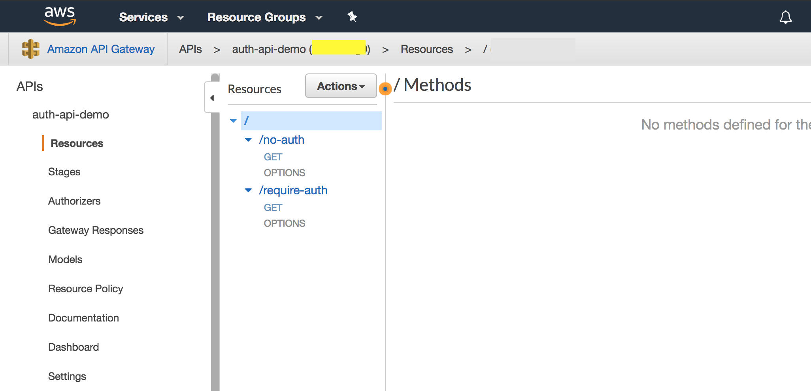

# Creating AWS Resources

This script doesn't have error handling and assumes a "happy path". It makes setting things up more convenient than
using the UI, but [Cloud Formation](https://aws.amazon.com/cloudformation/) or [Terraform](https://www.terraform.io/)
are better options for more robust AWS configuration and maintaining of AWS environments.

### Assumption / Requirements
* AWS account: id, region, [credentials file](https://docs.aws.amazon.com/cli/latest/userguide/cli-multiple-profiles.html)
* Create and Deploy Lambda/API first, so you can find the API's id.

*Getting API ID*
From the AWS Console, go to the API Gateway and click on your API

The ID will be in the area highlighted in yellow. (highlight is in picture only)

## Running the setup script

* run `npm install` in scripts directory
* Copy `sample.env` to `.env`
* Set AWS account id, credential file profile and region.
* Set API Gateway API ID.
* Pick and set a `BASE_NAME`.

The `BASE_NAME` variable should be mixed case, without hyphens and without numbers. This will be used to create resource names.